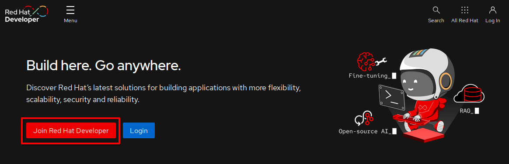
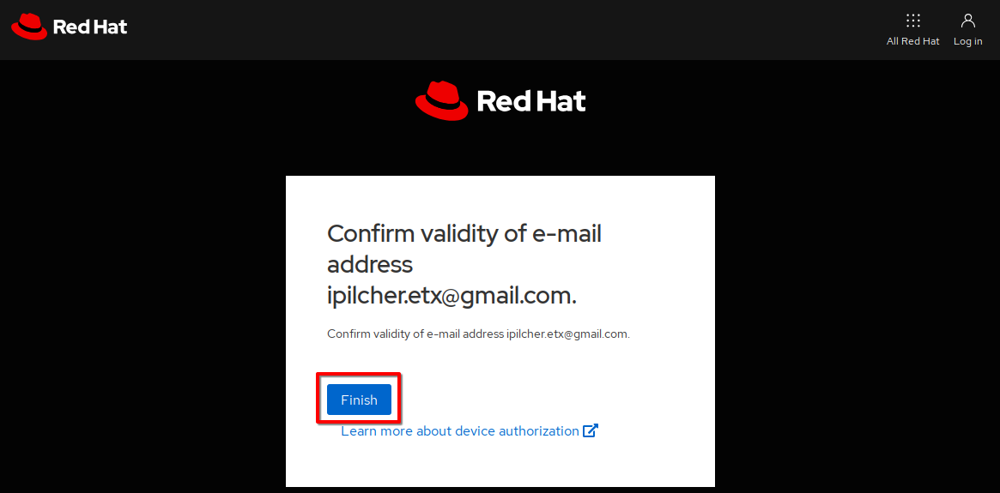
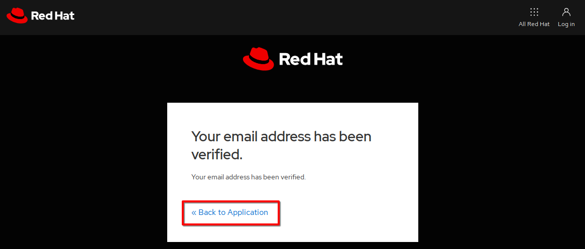
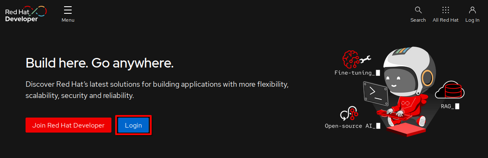
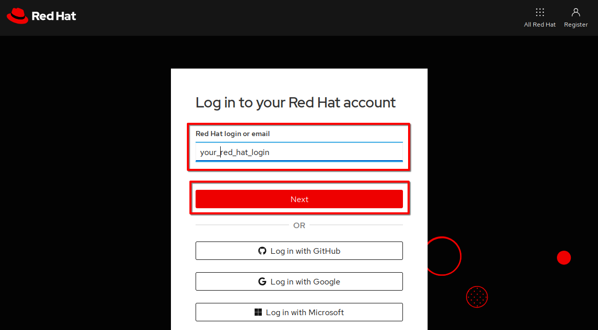
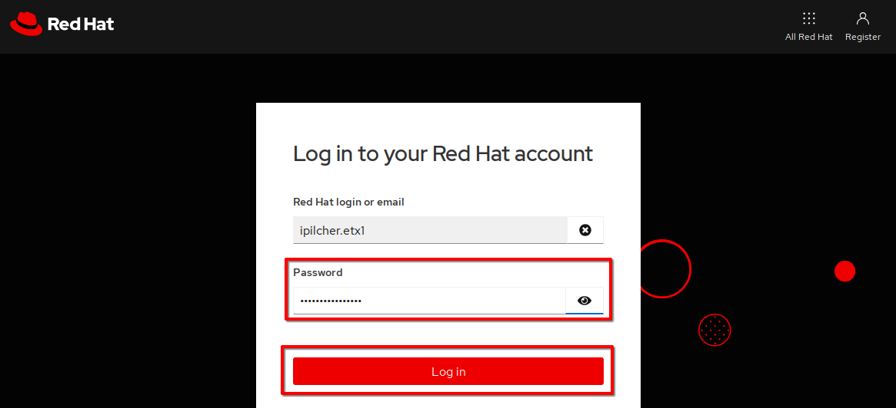
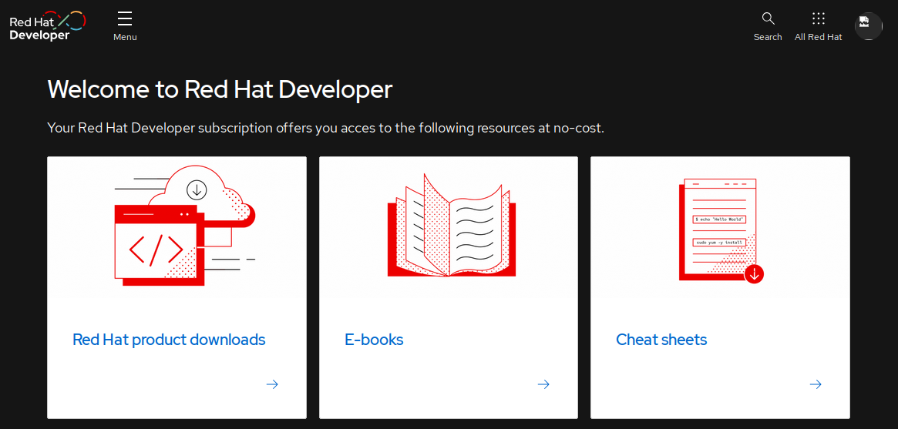

# Create a Red Hat Developer account

The **ETX Virtualization Delivery** workshop requires every attendee to have a
Red Hat account in order to access certain Red Hat software.  It is strongly
recommended that all attendees create a Red Hat developer account for use
during the workshop.  This is true even for attendees that have one or more
existing Red Hat accounts.

If desired, a service such as [GMail](https://gmail.com) can be used to create a new (possibly
temporary) email address to avoid interfering with any existing Red Hat logins.

1. Navigate to https://developer.redhat.com.

1. Click on the **Join Red Hat Developer** button.

   

1. Complete the registration form.

1. When the verification email arrives, click on the
   **Link to e-mail address verification** link.

1. Click on the **Finish** button.

   

1. Click on the  **<< Back to Application** link.

   

1. Click on **Log In**.

   

1. Enter your new Red Hat account name and click on the **Next** button.

   

1. Enter the password for your new Red Hat account and click on the **Log in**
   button.

   

1. You should be taken to the **Welcome to Red Hat Developer** page.  This
   confirms that you have successfully created your developer account.  These
   credentials can be used during the workshop when a Red Hat login is required.

   
