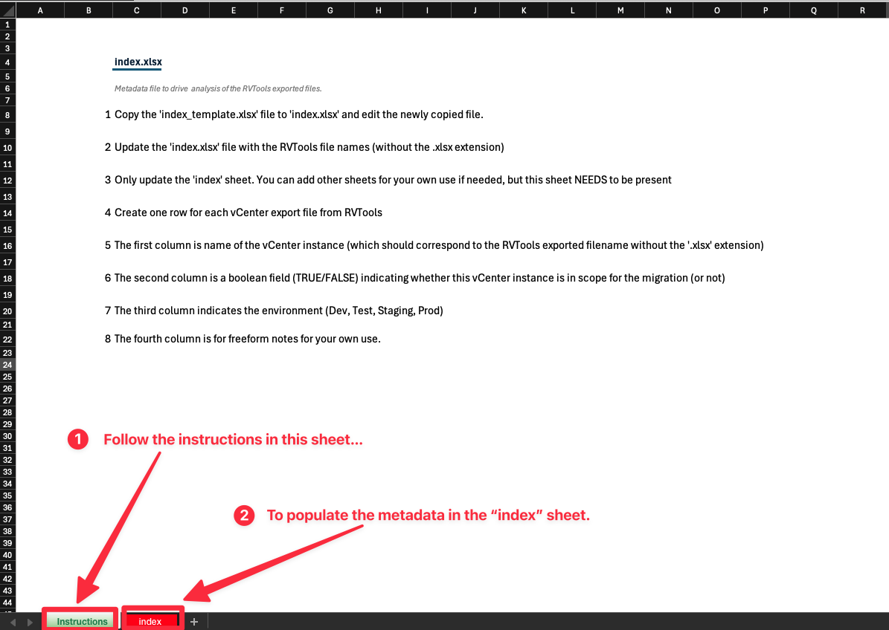
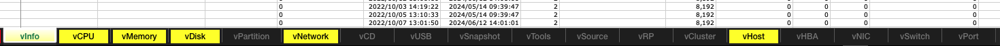
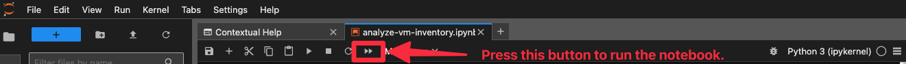

# Analysis Tool for VMWare Inventories
This tool analyzes VMware inventory reports generated by [RVTools][rvtools] and produces comprehensive reports and visualizations to assess the virtual machine (VM) inventory and the complexity of migration to the Red Hat [OpenShift Virtualization][osv] platform.

## Overview
* Parses and processes RVTools exports to extract key VM details.
* Generates reports and charts to assess migration feasibility and complexity.
* Uses [Jupyter Notebooks][jupyter] for interactive analysis.
* Leverages [NumPy][] and [Pandas][] for data manipulation and calculations.

## Supported Operating Systems
This tool has been tested on:
* Fedora 34 and later
* macOS 14 (Sonoma) and later
* Windows 10 and later

## Prerequisites
### Linux/macOS Requirements
Ensure the following are installed:
* Python (>= 3.10)
* pip (Python package manager)
* Git (for version control)
* xclip (clipboard management for Linux)
* LibreOffice or Microsoft Excel (for spreadsheet processing)

### Windows Requirements
Ensure the following are installed:
* Python (>= 3.10)
* Git
* LibreOffice or Microsoft Excel
* Visual Studio (Community Edition) (required for compiling dependencies)
* Rust (required for some Python dependencies)

## Usage
### Setting Up the Environment
**1. Clone the Repository**
* If you have your SSH public key uploaded:
```sh
git clone ssh://git@gitlab.consulting.redhat.com:2222/ansengup/rvtools-virt-analysis.git
```
* If you do not have your SSH key uploaded, use HTTPS instead:
```sh
git clone https://gitlab.consulting.redhat.com/ansengup/rvtools-virt-analysis.git
```
(You will be prompted to enter your GitLab username and password.)


**2. Navigate to the Project Directory**
```sh
cd rvtools-virt-analysis
```

**3. Set Up a Python Virtual Environment**

You can create a Python 3.x virtual environment using venv or virtualenv (or any other tool of your choice).

#### Automated Setup
A shell script (setup.sh) for Linux/macOS and a batch file (startanalyzer.bat) for Windows are included to automate the setup and launch Jupyter Lab:
* Linux/macOS:
```sh
./setup.sh
```
* Windows:
```sh
startanalyzer.bat
```

#### Manual Setup
If you prefer to set up the environment manually, follow these steps:
* Linux/macOS:
  * Create a virtual environment inside the project's root directory:
  ```sh
  python3 -m venv .venv
  ```
  * Activate the virtual environment:
  ```sh
  source .venv/bin/activate
  ```
* Windows:
  * Create a virtual environment:
  ```sh
  python -m venv .venv
  ```
  * Add the virtual environment scripts to your system path:
  ```sh
  set PATH=%USERPROFILE%\mywork\rvtools-virt-analysis\.venv\Scripts;%PATH%
  ```
  * Activate the virtual environment:
  ```sh
  .venv\Scripts\activate
  ```

> **Note:**
> - The commands above create a hidden `.venv` directory inside the project.
> - Unless you add `.venv/bin` (Linux/macOS) or `.venv\Scripts` (Windows) to your system path, you will need to specify the full path when using `pip` or `python`.

**4. Set Up a Containerized environment**

Alternatively, rvtools-virt-analysis can be run in a containerized environment.

#### Automated Setup
A shell script (run-container.sh) for Linux/macOS is provided to quickly and easily start Jupyter Lab:
* Linux/macOS:
```sh
./run-container.sh
```

#### Manual Setup
If you prefer to set up the environment manually, follow these steps:
* Linux/macOS:
  * Build container image
  ```sh
  podman build -t rvtools-virt-analysis .
  ```

  * Ensure container doesnt already exist
  ```sh
  podman ps -a | grep rvtools-virt-analysis && podman rm rvtools-virt-analysis
  ```

  * Start container
  ```sh
  podman run --rm -p 8888:8888 -v $(pwd)/data:/app/data:z --name rvtools-virt-analysis localhost/rvtools-virt-analysis
  ```

#### Access Jupyter Labs

Once the container has been successfully built and started, you should see some log entries similar to the following.  Port tcp/8888 has been forwarded to the container, so click/open the `http://127.0.0.1:8888/lab?token=<token>` link.  You should successfully access Jupyter Labs.

```
    To access the server, open this file in a browser:
        file:///root/.local/share/jupyter/runtime/jpserver-1-open.html
    Or copy and paste one of these URLs:
        http://49d6660cece7:8888/lab?token=<token>
        http://127.0.0.1:8888/lab?token=<token> <<<< Open this link
```

**5. Upgrade pip to the Latest Version**
* Linux/macOS:
```sh
.venv/bin/pip install --upgrade pip
```
* Windows:
```sh
.venv\Scripts\pip.exe install --upgrade pip
```

**6. Install Dependencies**
* Linux/macOS:
```sh
.venv/bin/pip install -r requirements.txt
```
* Windows:
```sh
.venv\Scripts\pip.exe install -r requirements.txt
```

## Preparing the Data
> **Note:**  
> If the RVTools export consists of multiple CSV files instead of a single XLSX file, you can use the CSV parser script (`rvtools-csv-parser.py`) included in this repository to generate a single XLSX file with the proper tabs.  

**1. Copy Exported Spreadsheets**
* Move or copy the exported spreadsheet files from the client's RVTools output into the `data` directory

**2. Create an Index File**
* Copy the file `index_template.xlsx` and rename it to `index.xlsx` inside the `data` directory.

**3. Update `index.xlsx`**
* Follow the instructions inside the file.
* Remove sample entries before proceeding.


**4. Verify Exported Worksheets**
* Ensure the exported RVTools spreadsheets contain the default set of worksheets.
* The worksheets highlighted in yellow in the following image are required for analysis:

  * **Mandatory worksheets:**
    * vInfo
    * vHost

  These sheets must be present with the exact spelling as shown.

**5. Ensure Correct File Naming**
> **⚠️ Warning:**  
> All RVTools export files must be in lowercase, including both the filenames and the corresponding names referenced in `index.xlsx`.
> Failure to maintain consistent lowercase formatting may result in errors during data processing.

* The exported spreadsheet **filenames** (excluding the file extension .xlsx) must match the corresponding vCenter instance names.
  * Example:
    * If the vCenter instance is named `avcenterinstance123`, the exported file should be named: `avcenterinstance123.xlsx`

## Running the JupyterLab Notebook
> **Note:**
> - If you have already executed the `setup.sh` (Linux/macOS) or `startanalyzer.bat` (Windows) script, you can skip this section.
> - These scripts automate the setup process by creating and activating the virtual environment (`venv`), installing all required dependencies using `pip`, and launching `Jupyter Lab`.


**1. Activate the Python Virtual Environment**
* Ensure that the virtual environment is activated in your shell.

**2. Start JupyterLab**
* Run the following command in the terminal:
```sh
jupyter lab
```

**3. Access the Notebook**
* JupyterLab should launch automatically in your default web browser.
* If it does not open automatically, navigate to:

<http://localhost:8888/lab>

* Once JupyterLab opens, you should see the following interface:


**4. Select the Notebook**
* In the file explorer pane on the left, open `analyze-vm-inventory.ipynb`

**5. Follow the Notebook Instructions**
* The notebook contains step-by-step guidance.
* If the data has been prepared as described earlier, it should run automatically with minimal input.

**6 Execute All Notebook Cells**
* Run all the cells in sequence.
* The execution should take 60-90+ seconds, depending on the number of vCenter inventory files being processed.



## General Notes
* These instructions assume the use of a `Linux/macOS/WSL` shell such as bash or zsh. If using a different shell, such as `Windows PowerShell`, adjust the commands accordingly.
* If analyzing more than 18 files, update the nrows=19 variable in the `Read the index metadata file` section of the Jupyter notebook.
  * Set nrows to the total number of files + 1 (to account for the header row in the index file).

## Author(s)
1. Anupam Sengupta (ansengup@redhat.com)

2. Freddy Montero (fmontero@redhat.com)

3. Jon Harding (jharding@redhat.com)

Red Hat Inc.

## Issues, Suggestions, or Contributions
If you encounter any issues, have suggestions, or would like to contribute to the project, please follow these guidelines:

**1. Reporting Issues**
* Clearly describe the problem, including:
  * Steps to reproduce the issue
  * Expected vs. actual behavior
  * Error messages (if any)
  * Relevant system details (OS, Python version, etc.)
  * Submit issues through the project's GitLab issue tracker.

**2. Suggesting Enhancements**
* If you have ideas for improvements or additional features:
  * Describe the problem your suggestion aims to solve.
  * Propose a potential solution or implementation approach.
  * Provide any relevant references or examples.

**3. Contributing to the Project**
* Fork the repository and create a new branch for your changes.
* Follow best practices for code quality and documentation.
* Submit a merge request (MR) with a clear description of your changes.
* Ensure your code is tested before submission.

For general discussions or questions, feel free to reach out via Slack


[rvtools]: https://www.robware.net/

[osv]: https://www.redhat.com/en/technologies/cloud-computing/openshift/virtualization

[jupyter]: https://jupyter.org/

[Numpy]: https://numpy.org/

[Pandas]: https://pandas.pydata.org/
